Building the ACSI2STM PCB
=========================

You can find the PCB and its sources in the pcb directory.

The PCB is built using EasyEDA. Source JSON files for EasyEDA are provided.

A Gerber package is provided. It was generated straight from EasyEDA so it
should be standard enough to be used as-is by any widespread manufacturer.

For people wanting to etch the PCB themselves, etching masks are provided in
PDF format.

The schematic is provided as a PDF and photo views as SVG if you don't want or
cannot use EasyEDA.

PCB Features and options
========================

Some parts are optional and some jumpers require soldering depending on what you
want or need to do.

The section below helps you decide what features and what components you will
need to build the PCB.

Power sources
-------------

**Warning**: Do not use the onboard USB socket of the STM32. USB data lines are
connected to the hard drive port, this **will** break things.

There are 4 options to power the board:

* Power via a 5V DC jack. Solder a DC jack in DC1 and use any standard 5V power
  adapter.
* Power via a floppy power plug. Solder 2.54mm header pins in J1 and use a
  floppy power cable. If you have an external floppy, chances are you already
  have a Y cable. Be careful to insert it the right way.
* Power via the USB serial converter. Put a jumper on J4 to use that solution.
* Power via the onboard USB jack of the blue pill. For this you need to make
  some modifications on the blue pill itself, see [hardware.md](hardware.md)

You can choose to omit some components such as the DC jack if you feel that you
don't need that solution.

SD card slots
-------------

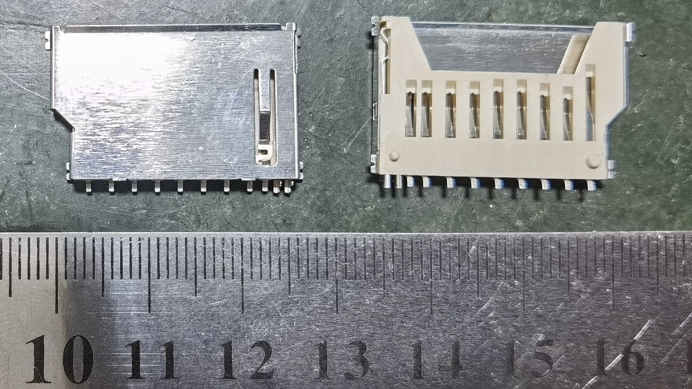

There are 4 SD card slots. Only the first one is mandatory, others can be
enabled or disabled with solder blobs (JP switches).

JP0 joins the SD lock switch sensor for the SD0 card reader. Put a solder blob
on it to enable SD lock switch. If omitted, the SD card will always be read-only
if ACSI_SD_WRITE_LOCK is set to 2 or read-write if ACSI_SD_WRITE_LOCK is set to
1 or 0.

JP1 to JP3 configure slots SD1 to SD3, respectively. If set in the top position,
the slot is completely disabled. This way, you can build a PCB with less SD
slots. The bottom position serves the same purpose as JP0.

**Warning**: Never solder the 3 pads of a same JP element together, this will
create a short.

Using a premade MicroSD reader instead of SD slots
--------------------------------------------------

If soldering SMD parts is a problem, you can fit a premade MicroSD reader PCB.
Fit the PCB in the top-left corner and solder on the 6 GND...CS pins.

If you use this solution, you are limited to only 1 slot. Omit C4, C5 and R1.

RTC battery
-----------

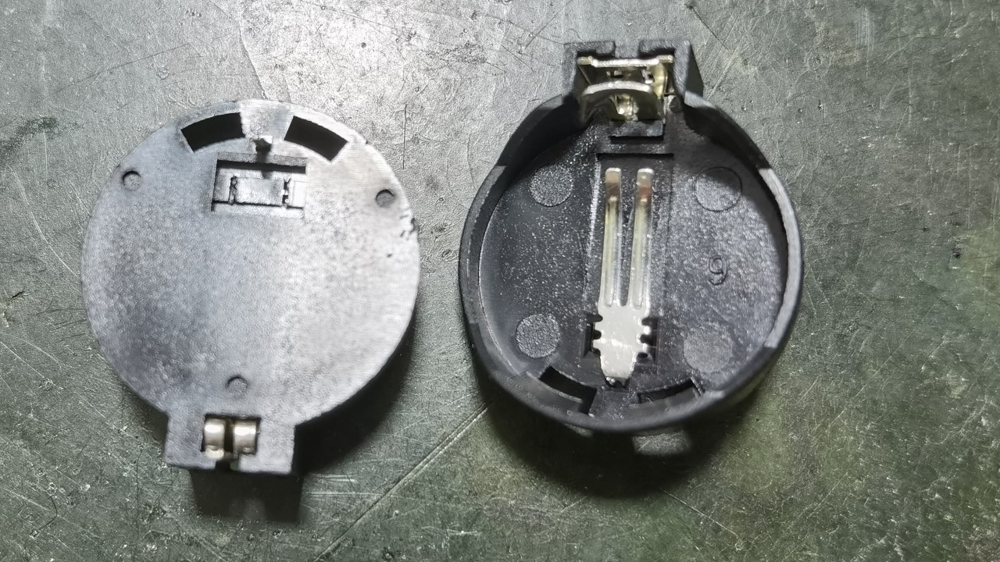

You can put a CR2032 battery holder to save date and time. It keeps the clock
running even when the unit is not powered.

The battery holder covers one floppy connector pin, so you will have to solder
floppy pins before the battery holder.

The C3 capacitor keeps power on while changing the battery. This is optional.

USB to TTL USART
----------------

To make firmware upgrades and serial output simple, a header matching many USB
to serial adapters was added. It is made for these models that have a jumper to
select 5V or 3V3. 3V3 is strapped to VCC and 5V is left unconnected.

You can power the whole board using this kind of adapter by connecting J4. You
can put a jumper on J4 to enable this temporarily.

**Warning**: When powering the board using the adapter, make sure not to power
it with any other method, power supplies may conflict and this could destroy
hardware.

PC floppy adapter
-----------------

Since the floppy port would be covered by the adapter anyway, the PCB relays the
floppy disk pins to a standard 34-pin PC floppy connector.

To build the special long pins that will reach the floppy connector, see the
section "Building floppy connector pins" below.

### FD density selection (J3)

The J3 connector allows putting a jumper to the pin 2 of the floppy drive. This
pin is used by some drives to select HD or DD floppy compatibility mode. Some
other drives have an output to tell what kind of floppy is actually inserted,
in that case you don't need any jumper.

If you don't know what to do, put a jumper in the DD position.

### Drive swap switch (S1)

Use S1 to indicate which kind of ribbon cable you use: twisted if you connect
the top row, straight if you connect the bottom row.

If you connect 2 floppies to the ribbon cable (with a twisted cable or by
setting drive jumpers), this switch will swap the 2 drives. The Atari hardware
supports 2 drives on the same connector, but STF/STE seem to use only the first
drive.

You can use either 2 jumpers or a suitable toggle switch:

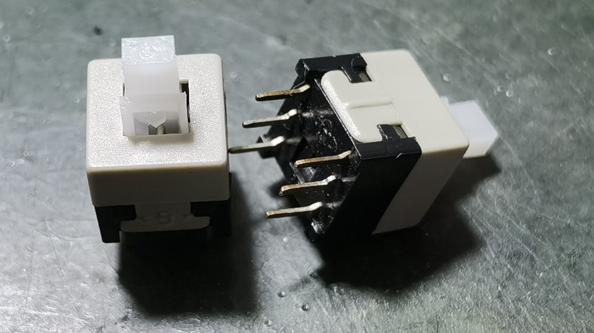

If unsure, connect in twisted mode with 2 jumpers (top position).

Optional / alternative components
---------------------------------

The PCB offers multiple choices for different form factors of the same
components. For example, it offers both surface mount and through hole options
for resistors and capacitors.

All components are optional, but the unit will perform worse: lower stability
and higher electromagnetic interferences.

### C1 and C2

If C2 is 100uF or more, omit C1.

If C1 is low ESR, you can probably omit C2. 10uF is recommended though.

### C3

C3 is there to keep the clock when changing the battery. It can be entirely
ommited if you think this feature is useless.

If you choose through hole components, put a 100uF capacitor in C3_TH and omit
C3. If you choose surface mount, put a 100uF capacitor in C3 and omit C3_TH.

If you want a longer retention time, put a bigger capacitor.

### C4 and C5

It is highly recommended to use surface mount for C4 and C5, both 100nF. If you
choose surface mount, you can omit C4_TH completely.

C4 is required for SD0 and SD2 slots. C5 is required for SD1 and SD3 slots.

If you don't want to use surface mount, put a 100nF capacitor in C4_TH and omit
both C4 and C5. Performances and noise will be worse, it might have a negative
effect on stability.

### R1

R1 is a pull-up resistor for the MISO line. It can be anywhere between 10k and
100k.

If you choose surface mount, populate R1 and omit R1_TH.

If you choose through hole, populate R1_TH and omit R1.

If you omit both R1 and R1_TH, you will have issues when hot swapping SD cards.

Building floppy connector pins
==============================

The floppy connector requires very long pins. If you want to use the floppy
connector adapter, you will need to build 14 special pins.

The pins must be at least 20mm long to correctly reach the connector from the
PCB.

You will need
-------------

### 1.24mm-1.28mm diameter hollow round pins

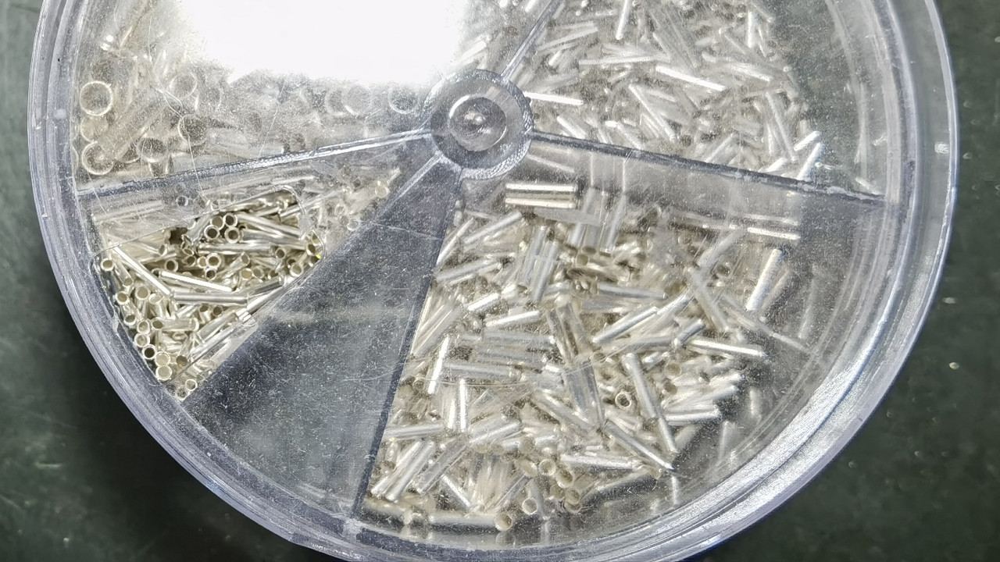

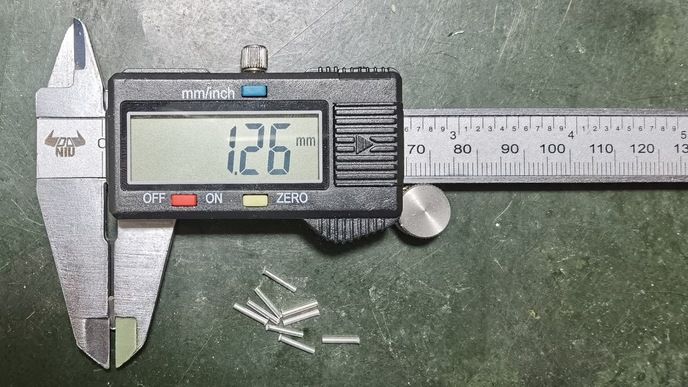

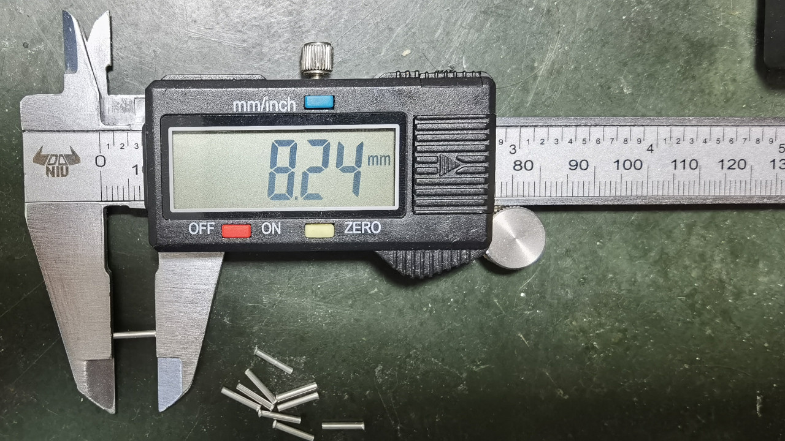

**Hint**: On online stores, these pins are often designated as
"EN0508 0.50mm² ferrule"

### 21mm long 2.54 standard square wrapping pins.

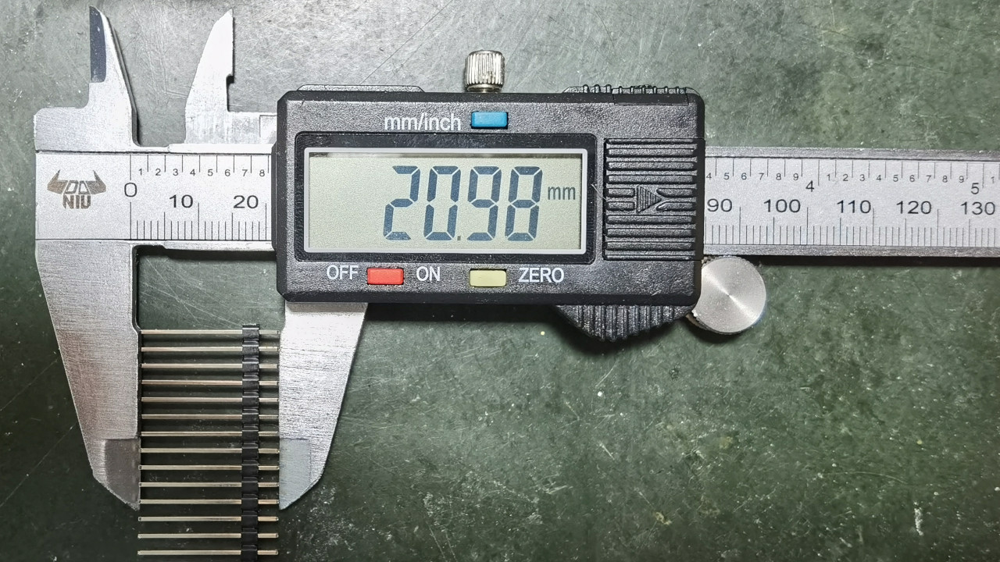

Building the pin
----------------

 * Insert the round pin in a vice.
 * Insert the square pin inside the round pin.
 * Make sure the square pin goes through the whole length of the round pin.

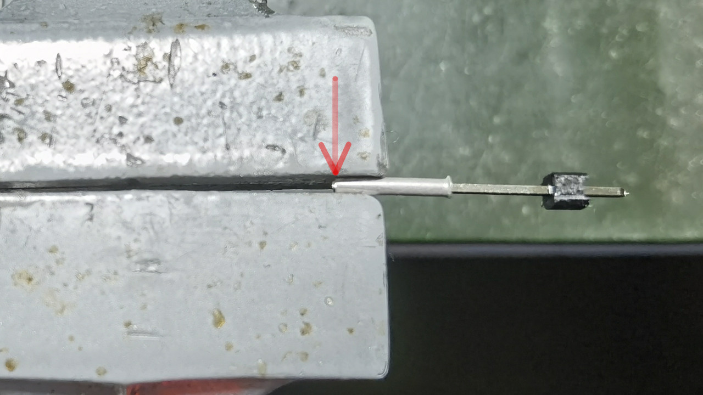

 * Solder the 2 pins together on the top part. Don't leave excess solder.
   Make sure that pin alignment is still correct after soldering.

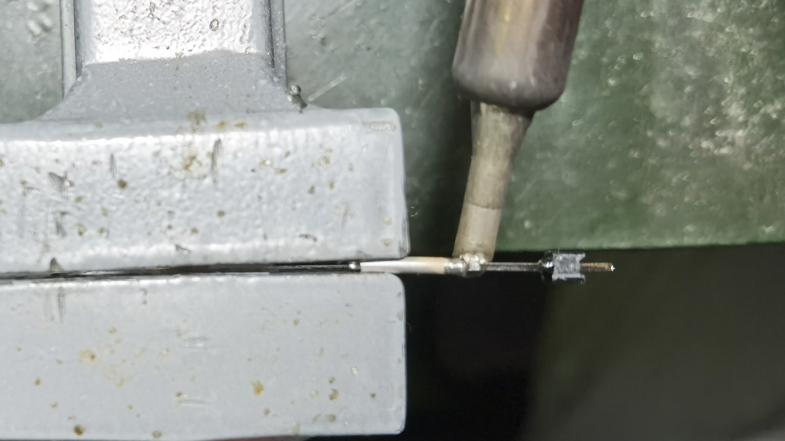

 * Cut the plastic part of the square pin. If a small bit of plastic remains
   it's not a problem.

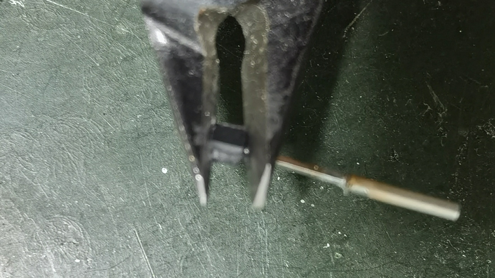

 * Make the big side sharp and pointy by cutting its tip at a 45° angle.

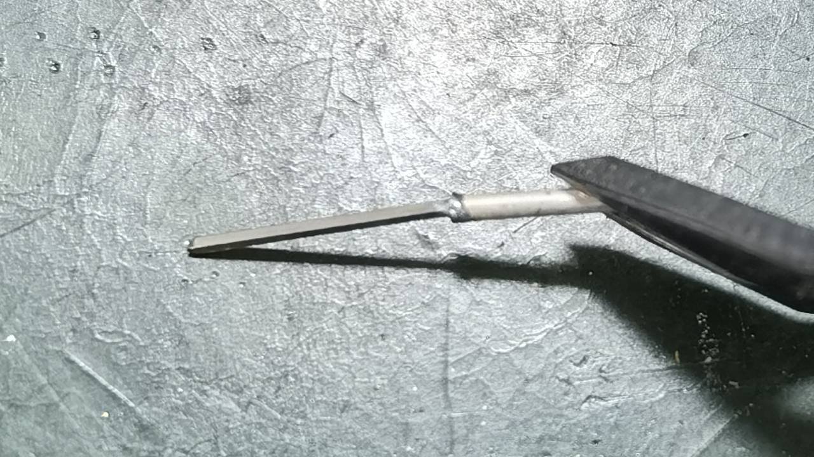

 * You should obtain a pin that looks like this

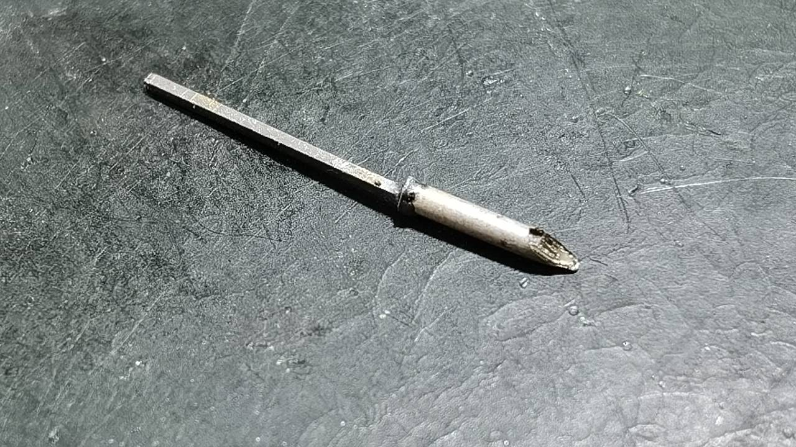

PCB assembly tutorial
=====================

The tutorial will explain how to build a full-featured PCB with surface mount
components. See the previous sections to understand alternatives to that setup.

You should follow the assembly order in order to maximize access to soldering
pads. Some components are tightly packed and cannot be soldered after some
others.

Step 1: SD card slots
---------------------

 * Put a solder blob on JP0
 * Put a solder blob on the bottom part of JP1, JP2 and JP3 to use the lock
   switch on all 4 SD cards. If you omit one or more SD slots, solder its
   matching JP in top position.
 * Solder the SD card slots.
 * Solder C4 (100nF 0805), C5 (100nF 0805) and R1 (100k 0805).

Step 2: Blue pill
-----------------

 * Solder 2 female headers for the blue pill. You can omit the 2 GND pins side
   by side on the bottom-right corner if it helps saving headers.

Step 3: HD connector
--------------------

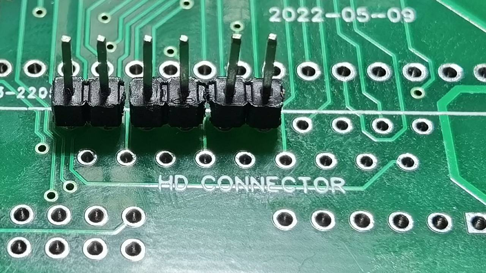

 * Use male 2.54 pin headers
 * Cut them 2 by 2
 * Solder them on the *bottom side*, they must be pointing on the side where it
   says "HD CONNECTOR".

Step 4: Power
-------------

 * Solder C2 (100uF 1206) or C1 (100uF) + C2 (100nF-10uF).
 * Solder C3 (100uF 1206) or C3_TH (100uF).
 * Solder the DC jack or male header pins on J1.
 * If you wish to power the ACSI2STM using the USB to TTL adapter, solder male
   header pins on J4 and put a jumper. You can strap the 2 pins permanently if
   you are sure that you will never have conflicting power sources.

Step 5: Floppy selector
-----------------------

 * Solder a toggle switch on S1.
 * Alternatively, solder male header pins on S1 and use 2 jumpers.
 * Another possibility is to strap S1 on the right position for your hardware.

Step 6: Atari floppy pins
-------------------------

See the "Building floppy connector pins" section above to build the 14 pins.

Soldering *must* be done on an Atari ST to align pins properly !
Be careful with the machine and limit soldering temperature to 300°C-350°C to
avoid damage to the internal circuits. The operation is not that risky if you
don't accidentally melt the case with the iron.

You can do this on a damaged ST (in fact this is recommended), all ST and STE
have the exact same spacing between the HD and floppy connector.

 * Insert one or more pins through the PCB (4 or 5 at the same time is best)

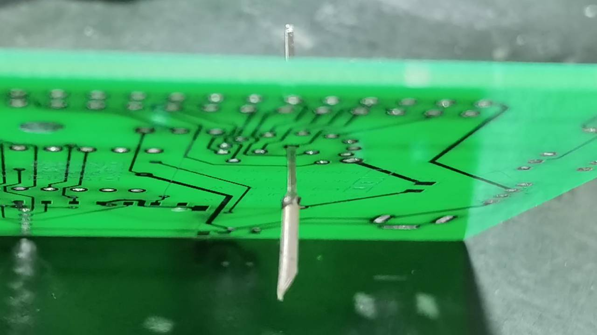

 * With the pins still in place, plug the board on the HD connector of the ST.

 * Wiggle pins so they fit their hole

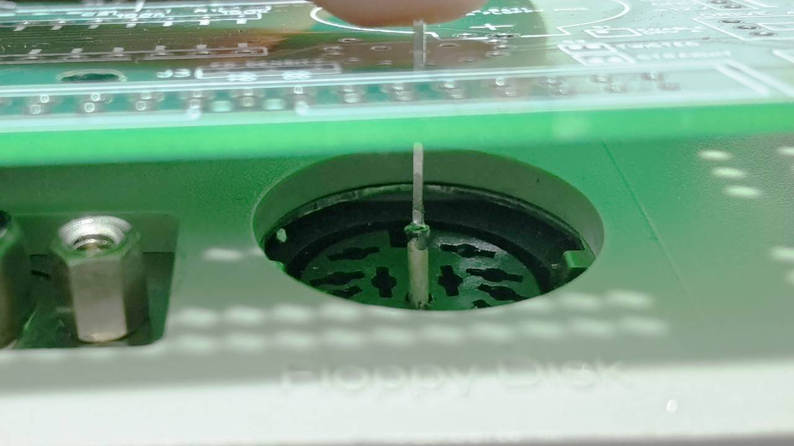

 * Insert pins completely with pliers so you have just enough to solder

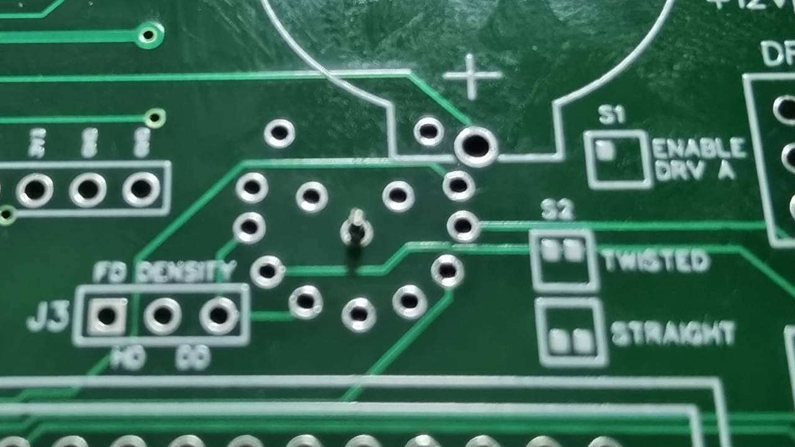

 * Solder the pins. Solder quickly to avoid transfering too much heat to the ST.

Step 7: PC floppy pins
----------------------

 * Simply solder male header pins to the P1 connector. You can use a proper IDC
   connector or just use loose pins.

Step 8: USB to TTL USART converter
----------------------------------

 * Solder a female header in J2.

Step 9: Battery holder
----------------------

 * Cut the back side of the floppy pin under the BAT1 case as short as possible.
   It should be flush with the PCB surface.
 * Solder the battery holder.
 * Insert a CR2032 battery in the slot.

Finished result
---------------

Here are a few pictures of a finished unit. This unit is an older version so it
has minor variations.

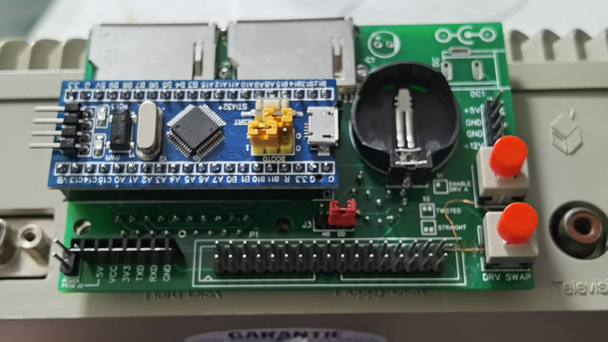

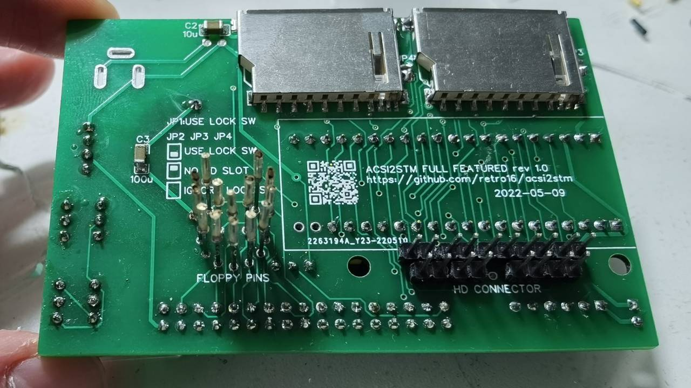

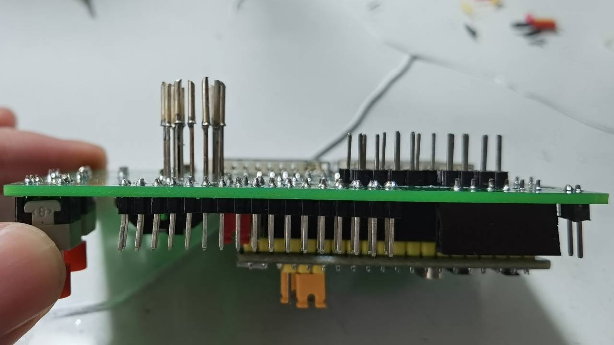

