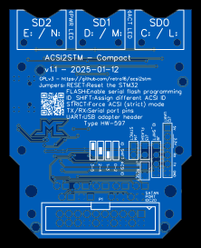

Changing operation modes with jumpers
=====================================

Compact board
-------------

**Note:** Some jumpers can also be permanently set by small solder blobs on the
PCB.

### Serial interface

The serial interface (STM32 PA9/PA10) is available on the PCB. This can be used
for programming the unit or debug output. Its pinout matches H43 / HW-597 CH340
USB adapters.

If the 5V pin is powered, the board will boot in serial flashing mode (BOOT0).

### RESET

The RESET pins will reset the STM32 when shorted, just like the push button on
the Blue Pill.

A tiny push button can be soldered for convenience.

### ID_SHIFT

The ID_SHIFT pins will change ACSI IDs of the ACSI2STM unit. Refer to the
template on the board to get jumper positions. With no jumper SD cards will have
ACSI ids 0 to 2, and putting the jumper in different positions can shift IDs to
1-3, 2-4 or 3-5.

### FLASH

Put a jumper to enable flashing firmware. This is equivalent to the BOOT0 (top)
jumper of a Blue Pill.

Remove the jumper for normal operation.

### ACSI

Put a jumper to enable ACSI strict mode. GemDrive will be disabled and all 3 SD
cards will behave like Atari hard disks.

**NOTE:** This jumper must be removed to program the STM32 using the serial
port. This limitation is not present for `HDDFLASH.TOS`.

### SATAN PORT

This can be populated with an IDC20 socket.

This connector is compatible with Satan/UltraSatan cables.

The connector can be used in both directions: either to connect to the ST or to
connect additional devices.

**NOTE:** You can use female headers with long pins to make a stackable unit.
The female part must be on the inner side (backup battery side).
In that case, you won't be able to plug the unit on the DB19 socket anymore.

Changing operation modes with jumpers on the Blue Pill board
------------------------------------------------------------

The STM32 blue pill has 2 jumpers. You can access to different operation modes
just by switching these jumpers to different places.

**Warning:** Do not attempt any other combination than what is explained here.
You might damage your product.

ACSI id 0 to 4, GemDrive enabled

     _______________________________
    |                     _         |
    |   [==] o        /\ | |       -|--
    |   [==] o       /  \| |       -|--
    |                \  /| |       -|--
    |     (o)         \/ |_|       -|--
    |_______________________________|

ACSI id 1 to 5, GemDrive enabled

     _______________________________
    |                     _         |
    |    o o o        /\ | |       -||¨| <- Jumper here
    |   [==] o       /  \| |       -||_|
    |                \  /| |       -|--
    |     (o)         \/ |_|       -|--
    |_______________________________|

ACSI id 2 to 6, GemDrive enabled

     _______________________________
    |                     _         |
    |    o o o        /\ | |       -|--
    |   [==] o       /  \| |       -||¨| <- Jumper here
    |                \  /| |       -||_|
    |     (o)         \/ |_|       -|--
    |_______________________________|

ACSI id 3 to 7, GemDrive enabled

     _______________________________
    |                     _         |
    |    o o o        /\ | |       -|--
    |   [==] o       /  \| |       -|--
    |                \  /| |       -||¨| <- Jumper here
    |     (o)         \/ |_|       -||_|
    |_______________________________|

ACSI id 0 to 4, GemDrive disabled - ACSI mode forced

     _______________________________
    |                     _         |
    |   [==] o        /\ | |       -|--
    |    o [==]      /  \| |       -|--
    |                \  /| |       -|--
    |     (o)         \/ |_|       -|--
    |_______________________________|

GemDrive disabled, other ACSI ids

     _______________________________
    |                     _         |
    |    o o o        /\ | |       -|--
    |    o [==]      /  \| |       -|--
    |                \  /| |       -||¨| <- Jumper here
    |     (o)         \/ |_|       -||_|
    |_______________________________|

The ACSI id selection jumper on the right works the same as in GemDrive mode

Firmware programming mode

     _______________________________
    |                     _         |
    |    o [==]       /\ | |       -|--
    |   [==] o       /  \| |       -|--
    |                \  /| |       -|--
    |     (o)         \/ |_|       -|--
    |_______________________________|

