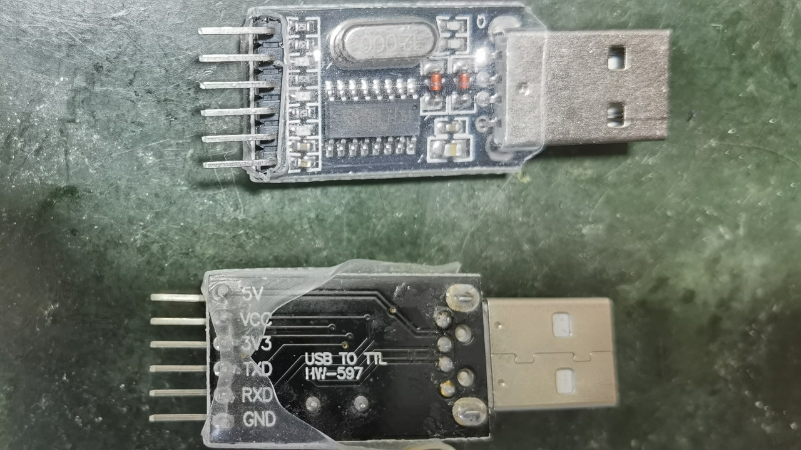
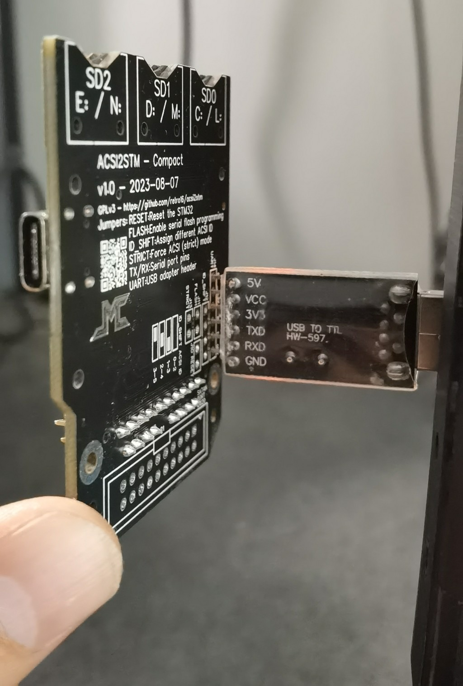
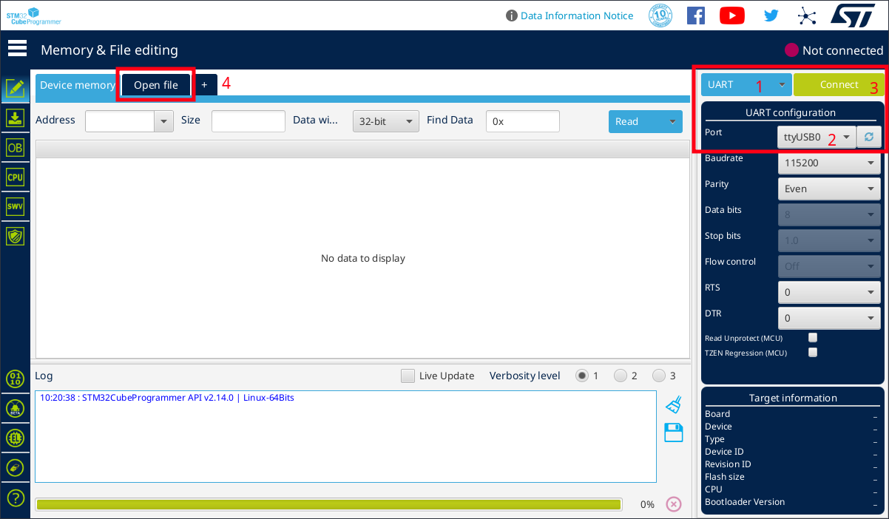
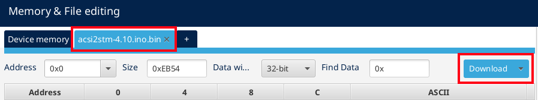

Ordering the hardware
=====================

This document explains how to order official PCBs and flash the firmware.

**Warning:** The ACSI2STM authors do not give any warranty on the final product.
Your money goes directly to JLCPCB, these are **not** affiliate links.
ACSI2STM authors do not receive any compensation, directly or indirectly, and
are thus not required to provide support.

JLCPCB is cited purely as a convenience. They provide reliable STM32 chips,
which is the most important problem to solve. You are free to choose any other
service provider for PCB assembly - or assemble it yourself.

Downloading necessary files
---------------------------

Download the latest release package. It contains all PCB design files as well as
the firmware.

The latest binary release package is available on the
[GitHub release section](https://github.com/retro16/acsi2stm/releases)

How to order the pre-assembled compact PCB
------------------------------------------

You can order pre-assembled PCBs, ready to use.

* You will need files in the `pcb/Compact` or `pcb/Super Compact` folder of the
  release package. For the Super Compact version, adapt file names below.
* Create an account on [JLCPCB](https://jlcpcb.com) if you don't have any.
* Log in to your JLCPCB account.
* Open the [JLCPCB ordering page](https://cart.jlcpcb.com/quote).
* Click *Add gerber file* and select `Gerber - ACSI2STM Compact.zip`.
* Check that dimensions are 64.26x51.31 mm (for the Compact PCB)
  or 31.24x46.1mm (for the Super Compact PCB).
* Change the following settings:
  * *PCB Color*: choose the one you like. Choose green if unsure.
  * *Mark on PCB*: *Remove Mark*.
  * Enable *PCB assembly*
  * Select *Assemble top side*
  * PCBA Qty is the amount of PCBs with components assembled. Select 2 if you
    want only 2 fully working units and 3 extra unpopulated PCBs. This option is
    not available for all PCB colors.
  * *Tooling holes*: select *Added by Customer*
* In the *Bill of materials* window,
  * Click *Add BOM file* and select `BOM - ACSI2STM Compact.csv`.
  * Click *Add CPL file* and select `PickAndPlace - ACSI2STM Compact.csv`.
* In the next window, the whole BOM is summed up.
  * You should see *Total 18 parts detected* above the table. For the Super
    Compact version, you should see *Total 17 parts detected*.
  * If some parts are missing, make sure to check the *Basic Parts Only* check
    box when searching for a substitute. Basic parts are much cheaper than
    extended parts. The only extended parts are the STM32, SD slots, USB port,
    battery holder and jumpers.
  * Check that the *Total Cost* column has no value more than $2 except the
    STM32 chip that should be below $7. This is for 5 assembled units.
* Make a visual check of component placement. It should match the picture in the
  file `3D view - ACSI2STM Compact.png`.
* In the *Quote & Order* window, you need to select *Product Description*. I use
  the Research/DIY option, but feel free to choose the option that you feel the
  best for you.

### Manually soldered parts (Compact)

A few optional connectors are on the bottom side of the PCB and are not
assembled by JLCPCB by default:

* Configuration jumpers (RESET, ID_SHIFT, FLASH, ACSI): 2.54mm male square pins
* Serial/UART pins: 2.54mm 6x square pins female socket
* Satan/UltraSatan IDC20 connector: IDC20 male or 2.54mm male square pins

See [jumpers](jumpers.md) for documentation about these parts.

### Manually soldered parts (Super Compact)

The Super Compact board has an optional *RESET* push button.

Solder pads should fit most SMD push buttons as well as through hole buttons
soldered on the side of the PCB.

Flashing firmware
-----------------

JLCPCB does not offer pre-programming services for the STM32. You have to flash
the firmware using a USB to serial/UART adapter supporting 3.3V signals.

Firmware upgrades can be done from the Atari itself, so the USB adapter is only
needed for first time programming or for debugging/development purposes.

**Note:** All PCB variants share the same firmware. All firmware variants can be
used on the Compact, Super Compact and MegaSTE Internal PCB.

### USB programmer

The compact PCB has to be programmed with a USB to UART adapter. It requires an
adapter with a very specific pinout. Using any other model will require manual
wiring but should work without problems.

The required model usually matches the following keywords on most websites:

* H43 USB to TTL UART CH340
* HW-597 USB to TTL UART CH340

Pinout of the adapter:

* 5V
* VCC (connected to 3.3V or 5V by a jumper)
* 3.3V
* TXD
* RXD
* GND

**Hint:** With a bit of practice, it is possible to program the unit without
soldering a female header. Just insert the adapter's pins inside matching PCB
holes and hold it slightly slanted with a bit of force to keep good contacts
during the flashing operation. PCB holes are metal plated so it should provide
good enough contact.

**Note:** Make sure 5V is applied **before** the STM32 boots. The best way to do
that reliably is to plug the USB side of the adapter **after** plugging it into
the ACSI2STM PCB. Using USB extension cords help a lot.

**Note:** When using this kind of adapter, you don't need to enable the FLASH
jumper. The PCB is wired to enable flash mode when it senses power on the 5V
pin at power up / reset.

If you don't have that very specific model of adapter, plug as following:

* Make sure your adapter works with 3.3V signals. 5V signals may damage the
  STM32. 5V is only for triggering FLASH mode.
* Plug GND to the GND pin of your adapter.
* Plug TX to RX of your adapter, RX to TX of your adapter.
* Enable (short) the FLASH jumper or put 5V on the 5V pin of the UART header.
* Put a 3.3V source on any of the 3.3V pins of the UART header.
* As soon as power is applied, the STM32 is ready to receive its firmware.

**Note:** The Super Compact PCB has no FLASH jumper, you must put 5V on the 5V
pin at boot to enter firmware flash mode.

### Flashing using STM32CubeProg

Download [STM32CubeProg from st.com](https://www.st.com/en/development-tools/stm32cubeprog.html)

Install STM32CubeProg on your system and start it.

On the main window, select *UART* in the programmer type, then select the serial
port matching your UART adapter, then click *Connect*.

Click the *Open file* tab and select the `acsi2stm-XXX.ino.bin` file from the
release package.

To program the chip, click the *Download* button.

### Flashing using the stm32flash command-line

You need the `stm32flash` command-line tool available on the
[Arduino_STM32](https://github.com/rogerclarkmelbourne/Arduino_STM32/tree/master/tools)
repository, in the tools subdirectory.

Sample stm32flash command-line:

    stm32flash -w acsi2stm-XXXX.ino.bin /dev/ttyUSB0

You need to adapt the command-line for your setup: /dev/ttyUSB0 should point at
the virtual serial port connected to the STM32. On Windows and MacOS, it may use
slightly different syntax for the port.

