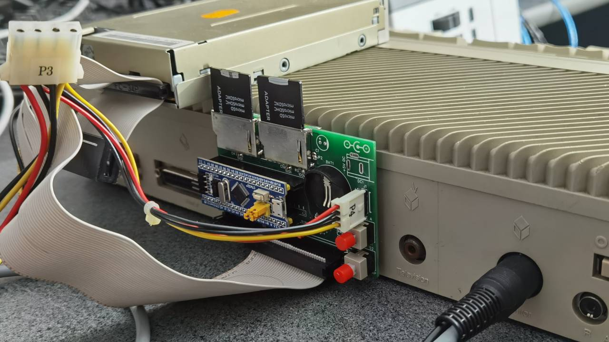

ACSI2STM PCB user manual
========================

This document describes how to install the official full-featured ACSI2STM PCB
on an Atari ST.

For instructions about the compact PCB, see [compact_pcb_manual.md](compact_pcb_manual.md).

For instructions to build this PCB, see [build_pcb.md](build_pcb.md).

For instructions on how to use the ACSI2STM, see [manual.md](manual.md).

Installing the PCB
------------------

Installing the PCB can be a bit tricky, especially inserting floppy pins.

* Plug the unit on the back of the ST. The mounting holes of the Hard Disk
  socket should be aligned.
* Put some screws to hold the unit in place.
  If you need screws, you can unscrew the hex screws of the Modem or Printer
  socket.

Powering the PCB
----------------

**WARNING**: Never plug 2 power sources at the same time.

You have several options to power the PCB.

* Use a 5V DC jack, center pin positive.
* Use a standard PC floppy power cable plugged in J1, red wire up.
* Use a compatible USB TO TTL USART adapter. You need to put a jumper on J4 to
  use power from the USB converter.
* Power via the onboard USB jack of the blue pill. For this you need to make
  some modifications on the blue pill itself, see [hardware.md](hardware.md)

Installing a PC floppy drive
----------------------------

You can optionally install a standard PC floppy drive or a floppy emulator on
the standard 34-pin connector. This will appear as drive B on the ST.

To use this floppy as drive A, a hardware modification of the ST is required.

The PCB supports both straight and twisted ribbon cables by setting S1
accordingly.

