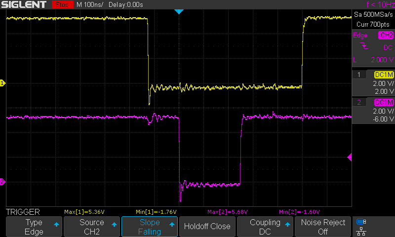
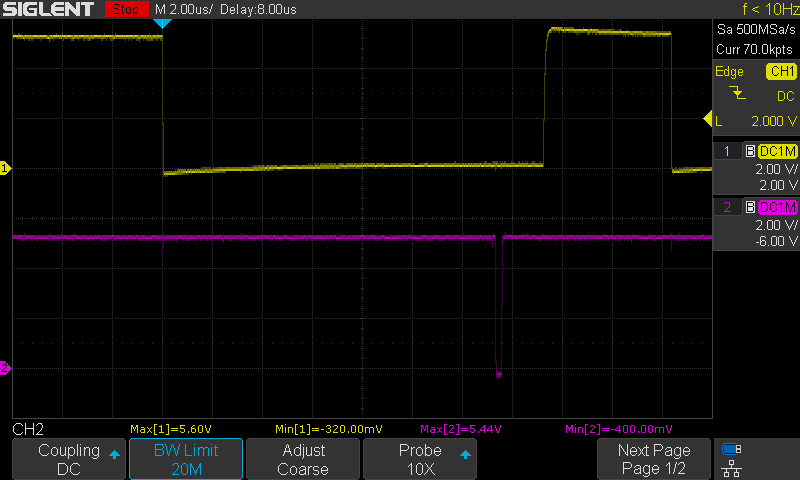
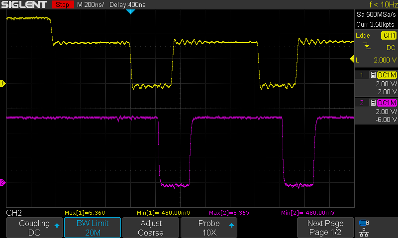

Communication protocols implemented by ACSI2STM
===============================================

This document describes the protocols implemented to communicate between the
Atari ST and the ACSI2STM module.

The Atari can communicate to up to 8 different peripherals connected to its DMA
(hard disk) port. The first communication byte specifies a unique ID to indicate
which peripheral is being addressed. This is usually called the ACSI id.

ACSI2STM allocates one ACSI id per SD card slot, making each slot independent.
By default, the first SD card starts at id 0, but this can be configured with
jumpers.

ACSI2STM behaves in 2 very different ways depending whether it is in ACSI mode
or GemDrive mode. The correct mode is selected per slot at reset.

At reset, the following algorithm is applied to each SD card slot:

* If the slot doesn't exist, it is completely disabled and the ACSI id is freed.
* If strict mode is enabled (via jumper or "strict" firmware variant), ACSI
  mode is enabled.
* If the SD card contains an ACSI disk image, ACSI mode is enabled.
* If the SD card is Atari bootable, ACSI mode is enabled.
* If the SD card can be mounted by the STM32, GemDrive mode is enabled.
* If no SD card is detected in the slot, GemDrive mode is enabled.
* If no other condition is satisfied, the SD card has an unknown format: ACSI
  mode is enabled.

Then, the first GemDrive slot is declared the boot slot: it behaves slightly
differently because all GemDrive communication happens through this slot.

Electronical level protocol
---------------------------

The DMA port can do 5 kinds of operations:

* Send a command start byte
* Send a command byte
* Receive a status byte
* DMA reads
* DMA writes

Communication is always initiated by the ST. A peripheral has no way to trigger
an interrupt or any other way to initiate a communication, despite the
(misnamed) IRQ pin.

For a description of each pin, see [hardware](hardware.md).

The protocol being very high speed, it is implemented using hardware timers and
DMA on the STM32. See [acsi2stm/DmaPort.cpp](../acsi2stm/DmaPort.cpp) for more
details.

### Command start byte (ST -> peripheral)

         _________
    IRQ
         __     __
    A1     |___|
         ___   ___
    CS      |_|
    
    DATA      ^

The ST pulls the A1 pin as well as the DATA pins (D7..D0) then pulses CS. Data
should be sampled when CS rises.

IRQ should be kept up all the time.

For the command start byte, D4..D0 bits specify the command, and D7..D5 specify
the ACSI id.

Example of a real ST trace (520 STF). Yellow (top) is A1, Pink (bottom) is CS:

Oscilloscope settings:

* Single capture mode, armed during the first floppy drive access at boot.
* 100ns/div horizontal.
* 2V/div vertical.
* DC coupling.
* Trigger on CS signal, falling edge, DC coupled, 2.0V level.

### Command byte (ST -> peripheral)

         __         __
    IRQ    |_______|
         _____________
    A1
         _______   ___
    CS          |_|
    
    DATA          ^

The peripheral pulls IRQ when it is ready to read the next command byte. When
the ST detects IRQ going low, it sets the DATA pins then pulses CS. Data should
be sampled when CS rises.
Once the peripheral sampled data, IRQ should be pulled up very quickly.

A1 is kept up all the time.

Note: some drivers incorrectly pull A1 on the second byte. That's what
`ACSI_A1_WORKAROUND` is trying to cope with.

Example of a real ST trace (520 STF). Yellow (top) is IRQ, Pink (bottom) is CS:

Oscilloscope settings:

* Single capture mode, armed during the first floppy drive access at boot.
* 2µs/div horizontal.
* 2V/div vertical.
* DC coupling.
* Trigger on IRQ signal, falling edge, DC coupled, 2.0V level.

### Status byte (peripheral -> ST)

         __         __
    IRQ    |_______|
         _______   ___
    CS          |_|
    
    DATA   [=======]

Status byte works exactly like a command byte, except that data is set by the
peripheral. The ST adjusts the R/W pin to indicate that it does a read instead
of a write. The ACSI protocol is fully deterministic so the R/W pin is not
strictly necessary.

Data should be present during the whole CS pulse. ACSI2STM sets data during the
whole IRQ pulse to be safe.

#### GemDrive variant: status byte with parameter

GemDrive uses status bytes as reverse commands in hook mode. Some commands
transmit a 4 bytes long parameter in fast mode (without waiting for IRQ):

         __      _                           ___
    IRQ    |____| |_________________________|
         _____   ____   ____   ____   ____   ___
    CS        |_|    |_|    |_|    |_|    |_|
    
    DATA   [ cmd ][prm 3][prm 2][prm 1][prm 0]

### DMA write (ST -> peripheral)

          ___              _________
     DRQ     |____________|
          ______________         ___
     ACK                |_______|
    
    DATA               [========]

Data is guaranteed to be available during the whole ACK pulse (marked "[==]").
Sampling right after the falling edge of ACK is your best bet.

### DMA read (peripheral -> ST)

          ___              _________
     DRQ     |____________|
          ______________         ___
     ACK                |_______|
    
    DATA                        ^

The peripheral pulses DRQ to request a byte write to RAM. Once the ST wrote the
byte in memory, it pulses ACK for a brief amount of time.

It seems that data is sampled when ACK rises, but data should be kept during the
whole exchange.

Example of a real ST trace (520 STF). Yellow (top) is DRQ, Pink (bottom) is ACK:

Oscilloscope settings:

* Single capture mode, armed during the first floppy drive access at boot.
* 200ns/div horizontal.
* 2V/div vertical.
* DC coupling.
* Trigger on DRQ signal, falling edge, DC coupled, 2.0V level.

**Note:** The DRQ line drops to 3.3V when the STM32 is active. This is still
within voltage tolerances of the ST.

ACSI protocol
-------------

The ACSI protocol is loosely defined as "SCSI with minor changes". In fact, this
is fully driver-dependent. Most drivers implement more or less some kind of SCSI
dialect, and most drives do the same thing. The lack of a well-defined standard
explains some compatibility issues.

### Supported SCSI commands

|   SCSI Command   | Byte | Comments                                           |
|------------------|:----:|----------------------------------------------------|
| TEST UNIT READY  | 0x00 | If any command byte is non-zero, returns an error. |
| REQUEST SENSE    | 0x03 | Returns the 0x70 page only                         |
| READ(6)          | 0x08 |                                                    |
| WRITE(6)         | 0x0a |                                                    |
| SEEK(6)          | 0x0b |                                                    |
| INQUIRY          | 0x12 |                                                    |
| MODE SENSE       | 0x1a | Returns page 4 and some legacy data in page 0      |
| Extended ICD cmd | 0x1f | See *ICD extended commands* below                  |
| UltraSatan       | 0x20 | See *UltraSatan extensions* below                  |
| READ CAPACITY    | 0x25 |                                                    |
| READ(10)         | 0x28 |                                                    |
| WRITE(10)        | 0x2a |                                                    |
| WRITE BUFFER     | 0x3b | mode 2: write to buffer, mode 5: flash firmware    |
| READ BUFFER      | 0x3c | Supports modes 0, 2 and 3                          |

### ICD extended commands

As ACSI command bytes cannot go beyond 0x1f, SCSI commands above 0x1f cannot be
sent as-is. The ICD extension is commonly used to send extended SCSI commands:

The first byte is sent as 0x1f + ACSI id, then a full SCSI command is sent.

ACSI2STM supports any command in ICD extended mode, including commands below
0x1f. For example, sending either 0x03 or 0x1f 0x03 will trigger REQUEST SENSE.

### UltraSatan extensions

Some UltraSatan extended commands are implemented to support real-time clock.
The protocol transmits text commands in the extra 9 bytes after 0x20.

List of supported commands:

* USCurntFW: Query firmware version.
* USRdClRTC: Read real-time clock
* USWrClRTC: Set real-time clock

GemDrive protocol
-----------------

The GemDrive protocol is very different from ACSI. The ST starts the
communication by sending a single byte command, then it actively listens for
bytes and acts accordingly. In that state, the STM32 takes the initiative.

Unimplemented/wrong commands will be ignored to avoid being detected by another
driver.

### Initial commands (ST -> ACSI2STM)

These are sent with A1 low during the first byte.

#### 0x08: SCSI READ(6)

This is for compatibility with the TOS bootloader. GemDrive supports reading a
single sector, containing just enough driver to send command 0x09 then start
listening for hook commands. See *Hook protocol* below.

Expected ACSI command:

    0x08 0x00 0x00 0x00 0x01 0x00

Any other byte sequence after 0x08 will return an error.

Note: only the boot id responds to this command.

#### 0x09: Install GemDrive

Ask the ACSI2STM to install GemDrive. The ST enters in hook mode, then expects
the STM32 to install GemDrive in RAM and follow up with the initialization
process (just like command 0x11).

Used by the boot loader returned by command 0x08.

#### 0x0e: GEMDOS hook

Signals the ACSI2STM that a GEMDOS trap just happened. Enters in *Hook protocol*
mode.

DMA is set at the correct address to read GEMDOS call parameters.

#### 0x11: Initialize GemDrive

Ask the ACSI2STM to initialize GemDrive. The ST enters in hook mode, then
expects the STM32 to do the initialization process.

Used by `GEMDRIVE.TOS`.

#### 0x1f: ACSI command

You can send any ACSI command, just as if the drive was in ACSI mode.

**Warning**: modifying the content of the SD using SCSI block write commands
may conflict with the GemDrive driver and corrupt data.

### Hook protocol

Once any hook command is sent, the ST goes into hooked mode, using an entirely
different protocol.

The ST waits for a status byte (which becomes a command byte), then acts
accordingly.

Most command are followed by a 4 bytes long parameter. These bytes are
transfered in fast mode (see *GemDrive variant* above). For each command, if bit
0 of the command is 0, set DMA write (ST->ACSI2STM) after the command is
executed. If bit 0 is 1, set DMA read (ACSI2STM->ST) after the command is
executed.

* 0xa6: forward hook to TOS / continue boot routine
* 0xa4 [4x bytes]: Trap #1. *parameter* ignored.
* 0xa2 [4x bytes]: Trap #13. *parameter* ignored.
* 0xa0 [4x bytes]: Trap #14. *parameter* ignored.
* 0x9e [4x bytes]: Push SP to stack. *parameter* ignored. Set DMA address on
  stack.
* 0x9c [4x bytes]: Push *parameter* byte on the stack
* 0x9a [4x bytes]: Push *parameter* word on the stack
* 0x98 [4x bytes]: Push *parameter* long on the stack
* 0x96 [4x bytes]: Add *parameter* to SP. Set DMA address on stack.
* 0x94 [4x bytes]: Read byte at *parameter* and push it on stack.
  Set DMA address on stack.
* 0x92 [4x bytes]: Read word at *parameter* and push it on stack.
  Set DMA address on stack.
* 0x90 [4x bytes]: Read long at *parameter* and push it on stack.
  Set DMA address on stack.
* 0x8e [4x bytes]: Read byte from stack and write it to *parameter*
* 0x8c [4x bytes]: Read word from stack and write it to *parameter*
* 0x8a [4x bytes]: Read long from stack and write it to *parameter*
* 0x88 [4x bytes]: Call pexec(4, 0, *parameter*, 0) then return from exception
* 0x86 [4x bytes]: Call pexec(6, 0, *parameter*, 0) then return from exception
* 0x84 [4x bytes]: Set DMA at address pointed by the *parameter*.
* 0x83 [4x bytes]: read byte count from stack (word), and copy [byte count + 1]
  bytes from stack to the address pointed by *parameter*. SP is unchanged.
* 0x82 [4x bytes]: read byte count from stack (word), and copy [byte count + 1]
  bytes to stack from the address pointed by *parameter*. SP is unchanged.
* 0x80 [4x bytes]: Set D0 to *parameter* then return from exception.
* Any other byte will set D0 sign extended to a long (e.g. 0xdc will set D0 to
  0xffffffdc) and return from exception. Used to return TOS error codes.
