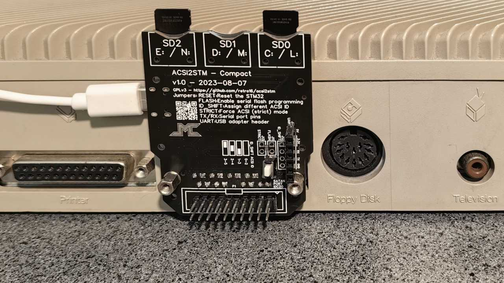
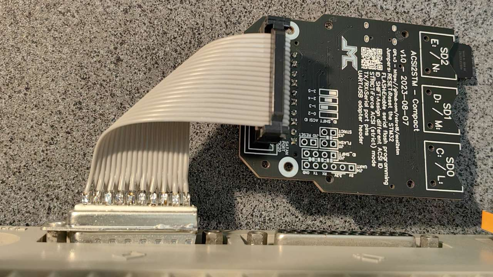

Quick start guide
=================

This document explains the steps to get the product running as quickly and as
simply as possible.

There are many possible variations, refer to other documents for more details.

If you want to order or build units, see [ordering](doc/ordering.md).

Installing the ACSI2STM unit on your machine
--------------------------------------------

### Powering the unit

Power the unit via its USB-C port. It has no specific power requirements, so any
5V USB-C adapter (or PC) should be able to power the unit.

### Backup battery

Before installing, insert a CR2032 battery in the socket. The battery is only
needed to keep the clock running when the ST is off.

### Installing on the DB19 port

* Plug the unit on the back of the ST, components toward the keyboard.
  The mounting holes of the Hard Disk socket should be aligned.
* Put some screws to hold the unit in place.
  If you need screws, you can unscrew the hex screws of the Modem or Printer
  socket.
* Optionally, you can plug other devices such as an UltraSatan on the IDC20
  socket.

### Installing using the UltraSatan (IDC20) port

If you mounted an IDC20 socket, you can connect the ACSI2STM unit through it
instead of the DB19 port. This is useful if you have other IDC20 devices.

**Note:** You can connect things on both the DB19 and IDC20 ports at the same
time, the ACSI2STM PCB can be used as an adapter.

Using the unit
--------------

Depending on which hardware you have, setup will be different.

On the most standard configuration (no internal hard drive, no other device),
just plug the unit, power it on before turning on the ST, and there you go: a C:
drive will appear that corresponds to the first SD card slot.

Slots behave like a floppy drive: you can insert / swap SD cards at any time
without rebooting. You can even boot with no SD card inserted, it will just
work. Make sure that you don't hot swap while programs do file access.

See [standard configurations](standard_configurations.md) to setup the unit.

See [tutorial](tutorial.md) if you have no prior experience with hard drives on
the ST. Among other things, it explains how to add icons for the extra microSD
slots on the desktop.

[jumpers](jumpers.md) explains how to change various jumpers on the board for
more complex configurations.

### Setting date and time

In GemDrive mode, you can use any tool to set the date, such as `CONTROL.ACC` or
`XCONTROL.ACC` available in the *Language disk* provided with the computer.
These tools can be found online easily if necessary.

Copy the accessory at the root of your `C:` drive, reboot, then run the *Control
panel* from the Desk menu. In `CONTROL.ACC`, click date and time to change them.

In ACSI mode, ACSI2STM emulates an UltraSatan clock, so you can use UltraSatan
tools such as `US_SETCL.PRG` and `US_GETCL.PRG`. GemDrive mode also responds to
UltraSatan clock queries as a convenience, but it doesn't need these tools.

When the system is switched off, the STM32 clock is powered by the onboard
CR2032 battery so it will keep time even when powered off.

Updating a 4.0 (or later) unit from the Atari ST
------------------------------------------------

ACSI2STM supports updating the firmware from the ST itself since version 4.0.
It uses the Seagate SCSI standard command to do that, this is supported by
ACSI2STM both in ACSI and GemDrive modes.

Steps to update your firmware:

* Download the release package and unzip it. The latest binary release package
  is available on the [GitHub release section](https://github.com/retro16/acsi2stm/releases)
* Choose which firmware variant you want to use (see [firmware](firmware.md)).
* Copy the firmware file (`acsi2stm-VERSION-VARIANT.ino.bin`) and rename it to
  `HDDFLASH.BIN`
* Copy `HDDFLASH.TOS` and `HDDFLASH.BIN` files on any medium readable by the
  ST (floppy, ACSI drive, GemDrive SD card, ...).
* If you load GemDrive using `GEMDRIVE.PRG` or `GEMDRPIO.PRG`, copy this file
  as well. Older versions may not be compatible with the newer firmware.
* If needed, copy the new `GEMDRIVE.PRG` or `GEMDRPIO.PRG` to the `AUTO` folder
  of the ST's boot drive. Do not reboot the ST before flashing the firmware.
* On the ST, run `HDDFLASH.TOS`.
* When prompted, choose the hard drive to update (usually ID 0).
* Press Y to start flashing.
* When finished, the ST and the ACSI2STM unit will both restart.

### Notes:

* The release package provides disk images that you can use to upgrade easily:
  they have a `FIRMWARE` folder with the standard variant already named as
  `HDDFLASH.BIN` so you just have to start `HDDFLASH.TOS`.
* On new TOS (>= 2.0) or EmuTOS, you can drag the firmware file on the
  `HDDFLASH.TOS` icon instead of renaming the image.
* When updating an ACSI2STM unit with multiple SD slots, you can select any slot
  to update the firmware for the whole unit. No need to do the update procedure
  multiple times.
* `HDDFLASH.TOS` works entirely in RAM, so you can start the program from the
  unit to update.
* If flashing fails or if the unit is bricked, you will have to upload the new
  firmware using the USB to UART dongle. Flashing the firmware cannot brick
  completely the unit, it can always be recovered with the UART dongle.
