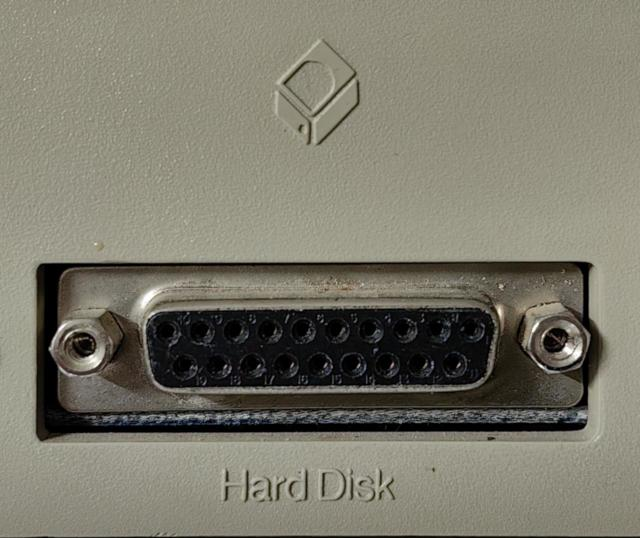
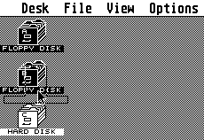
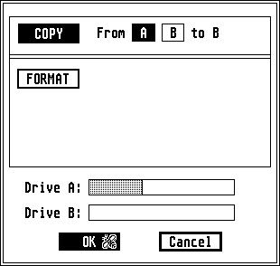
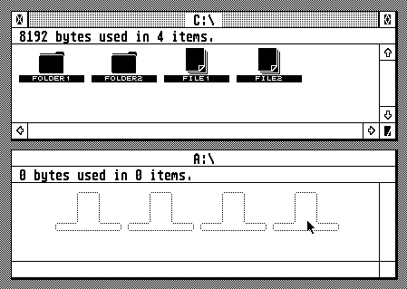
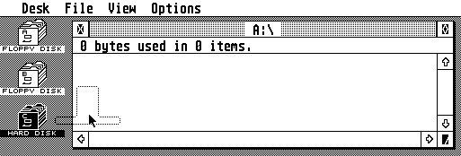
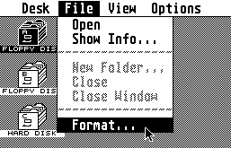
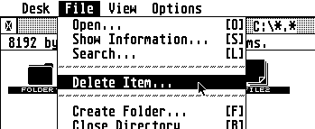

How hard disks work on the Atari ST
===================================

This document is aimed at people who don't have prior experience with using
hard disks on an Atari ST.

It talks about general concepts, not specific to ACSI2STM. It can be useful for
setting up real hardware as well as emulators.

Remember that using ACSI drivers is discouraged, you should probably use
GemDrive unless you have very specific needs or want an authentic user
experience (read: having a hard time struggling against old buggy software).

The physical "hard disk" port
-----------------------------

All Atari ST and derivatives have a *hard disk* socket somewhere. It's a DB19
female socket, a very rare kind that doesn't exist anymore.

Because it doesn't have a real name, it can be called *DB19*, *Hard disk*,
*ACSI* or *DMA port*.

This port is a bus, meaning that you can plug multiple devices on the same port.
Usually, devices are daisy-chained, meaning that each device has a female port
that can receive another device.

### IDC20 and UltraSatan connectors

Because DB19 isn't produced anymore and hard to find, modern hardware tend to
standardize around IDC20 (flat cable) connectors.

With these connectors, you can put many plugs on the same flat cable to connect
multiple devices on the bus, just like PC floppy or IDE drives.

### DMA plague, Bad DMA, faulty hardware

It's so important that it needs to be mentioned in a beginner tutorial: many ST
have partially faulty DMA ports. It was a very common issue that nobody
suspected because hard drives were rare back in the days, so people didn't
realize that their machine had a problem.

It randomly hits a very wide range of computers, from early STF to late Mega STE
and maybe even later models.

ACSI2STM *PIO* firmware could help, see [firmware](firmware.md).

Multiple devices and ACSI ID
----------------------------

Hard drives use a derivative of the SCSI protocol to communicate: ACSI.

You can plug up to 8 devices on the same port. In order to separate
communication between different peripherals, each peripheral is assigned a
unique identifier: a number between 0 and 7 (included).

Most ACSI peripherals have a selector to assign a specific device id. Some have
limited ranges, or use a fixed id.

**Warning:** The most important rule is: **DO NOT ASSIGN THE SAME ID TO MULTIPLE
DEVICES**. This will lead to devices trying to output signals on the bus at the
same time, which will put extra load on their internal circuitry; this could
damage the hardware.

Usually, you want to start at id 0 and put devices in increasing orders.

Software also brings its own limitations about ids. This is explained later.

### Mega STE internal hard drive

Some models have internal hard drives, however it seems that only the Mega STE
has an internal ACSI drive, sharing the DMA port. By default it is set on the
device id 0, but this can be changed by internal DIP switches.

### ACSI2STM

ACSI2STM provides a set of jumpers named `ID_SHIFT` which can change device ids
of the SD slots as well as their GemDrive drive letters. It can't map to all 8
ids freely though.

Device drivers and boot process
-------------------------------

Atari TOS doesn't have a full hard drive driver, meaning that you can't just
plug a hard drive and hope to see a sweet **C:** icon on the GEM desktop.

### How ACSI drivers work

When you bought a hard drive, it came with a driver on a floppy disk. The most
common driver was Atari's *AHDI* driver, a very bad driver full of limitations
and bugs. So other companies started to sell alternative drivers that work
better.

They all work on the same principle: you have a small TOS/PRG file that runs the
driver itself. It is usually installed in the `AUTO` folder of the driver floppy
disk. Along with this driver, there is a format/partitioning tool, and a boot
sector installer.

The formatting/partitioning tool works just like modern ones, so there isn't
much to say about it: Format, set partition sizes, apply settings, reboot and
there you go.

### The boot process

Thankfully, while TOS doesn't have a full hard drive driver, it has a boot
driver. It uses the same boot routine as floppy drives:

* For each device id, it reads the first sector (512 bytes)
* If read fails or times out, it tries the next device id
* If the sector has a checksum of 0x1234, it means that it's bootable
* If the sector is bootable, it just runs the content of the boot sector as code
* If the boot sector code returns, it tries the next device id

So when you have a hard drive, you can use its boot sector installer to install
a special boot sector on the hard drive that will load the full driver from the
drive itself.

Usually, the boot sector contains code that will load a special `*.SYS` file at
the root of the hard drive, and this file contains the actual driver.

The end result is that, once you properly installed everything, your ST won't
need floppy disks at all anymore (except protected games, but that's a special
case).

### Boot floppy

TOS is a bit lost when it has no floppy disk inserted into the internal drive.
Drive motor keeps spinning and some timeouts are very long, increasing boot time
a lot.

There are software workarounds, but the simplest way around that is to keep a
blank formatted disk in the drive at all times.

### The special case of GemDrive

GemDrive takes advantage of this boot process to start itself. When the ST asks
for a boot sector, the ACSI2STM unit provides the GemDrive driver embedded in
its own firmware. That's why you don't need to specially prepare SD cards.

### TOS quirks

Atari TOS has **many** quirks and bugs. Some of them can be worked around with
tons of software patches, but no configuration was ever proven to be fully
stable as soon as you start to really scale.

* Size limitations: partitions have absolute size limitations, depends on TOS
  version. *BigDOS* tries to alleviate this, but requires compatible drivers.
* Cluster size limitations: Windows scales FAT filesystems by increasing cluster
  sizes while TOS requires to scale FAT filesystems by increasing physical
  sector sizes. TOS fails in weird ways with Windows-style FAT filesystems.
* Folder count limitations: If you have too many folders, things start to behave
  strangely. `FOLDR100.PRG` tries to increase limits, with various degrees of
  success.
* TOS has no file/folder cache, which was provided by `CACHE100.PRG`.

The only way around that is not to use TOS at all, this is what GemDrive does.

GEM desktop and disk drive icons
--------------------------------

Depending on your TOS version, GEM can be a bit mysterious about how it handles
disk drive icons.

### `DESKTOP.INF` and `NEWDESK.INF`

GEM can save the desktop state, including desktop icons, preferences, view mode,
file extension associations and various other things.

On old TOS (TOS < 2.00) it is saved in `DESKTOP.INF` at the root directory of
the boot disk. New TOS uses the file `NEWDESK.INF` that contains much more
information, but it is still backward-compatible with `DESKTOP.INF`.

### Mounted drives

TOS maintains a list of mounted drives. This is invisible to the end-user, and
it differs from which icons are visible on the desktop. GEM does not provide any
way to know which drives are mounted or not, and does nothing to assist you.

When you try to access a drive letter that is not mounted from the desktop, you
will get the infamous *The drive you specified does not exist* message.

Most hard drive drivers will list mounted drives at boot.

### *C:* drive icon

GEM handles the C: drive specially: if the drive is mounted during boot process,
it will add the corresponding icon to the desktop. If the drive is not mounted
during the boot process, it will **actively remove** the icon, even if it was
present in your `DESKTOP.INF` file.

GEM doesn't care about other mounted drives, you will need to install them
manually (see below).

### Boot drive

TOS is a bit inconsistent about which drive is the boot drive. When booting,
GemDrive will select the first SD card as boot drive, starting `AUTO` programs,
accessories and loading `DESKTOP.INF`/`NEWDESK.INF` from there.
However, the *Save Desktop* feature will disregard that boot drive and use its
own logic. It seems that it tries to save to C:, and if C: doesn't exist it
saves to A:.

Different TOS versions behave differently regarding to boot drive.

### Installing drive icons

#### Old TOS (TOS < 2.00)

Older versions of TOS have a very peculiar procedure to install drive icons. You
need to install each of them manually:

* Select any pre-existing drive icon
* Open the Options menu and select *Install Disk Drive...*

* Type the drive letter in *Disk identifier*
* Optionally, you can label the icon
* Click install, the icon will appear on the desktop

* Don't forget to save the desktop

#### New TOS and EmuTOS

This is much more user-friendly:

* Open the Options menu and select *Install Devices*

* Don't forget to save the desktop

#### Notes

Weird things can happen when installing drives:

* Newly installed icons can be placed over or under an already existing icon. If
  you cannot find an icon, try to move other icons around. Make sure not to drag
  icons over other icons because it will trigger a copy operation !
* Drive `C:` needs to be typed upper case because `c:` is the cartridge drive.
  Other drive letters are case insensitive.
* Why *Install Disk Drive* is disabled when you don't select any icon is beyond
  me. It doesn't make any sense and looks like a bug IMHO. New TOS fixes this
  weird behavior.

### Removing drive icons

#### Old TOS

* Select the icon to remove
* Open the Options menu and select *Install Disk Drive...*
* Click *Remove*

**Warning:** Don't remove all drive icons on old TOS or you won't be able to
recreate any drive icon ! Saving the desktop while in this state is a bad idea.

#### New TOS and EmuTOS

* Select icon(s) to remove
* Open the Options menu and select *Remove Desktop Icon*

**Note:** New TOS can even remove multiple icons at once, just select all of
them at the same time.

Disk operations vs file operations
----------------------------------

Another common GEM quirk: how it handles disk and file operations.

### Disk copy

Dragging a drive icon over another drive icon triggers a disk copy operation:

This can be done only between `A:` and `B:` floppy drives. GEM will do a
low-level copy of the disk, so the resulting disk will have the same identifier
and the same content, as well as the same file fragmentation.

The GEM disk copy tool is not very sophisticated, you should use specialized
tools such as *ACOPY* or *FastCopy Pro*.

### File copy

File copies are just that: each file is read from the source, then written on
the destination folder.

There are 3 ways to trigger file copies in GEM:

#### Copy from folder to folder

This copies all selected files to the destination folder

#### Copy from drive to folder

This copies all files in the drive to the destination folder

#### Copy from folder to drive

This copies all selected files to the root of the destination drive

### Disk format

You would think that dragging a drive to trash would format it ? No ! There is
a menu for that: select the drive icon to format, then open the format menu:

GEM can only format floppy disks.

Just like disk copy, the GEM format tool is not very sophisticated, you should
use specialized tools such as *ACOPY* or *FastCopy Pro* for floppy disks. Hard
disk drives need specialized tools to format or partition the disk.

### File delete

In old TOS, the only way to delete files is to drag them on the thrash. To
delete all files from a drive, you need to select all files and folders at the
root of the drive and drag them all at once on the trash.

New TOS has a menu entry and a keyboard shortcut to delete files, making the
trash icon obsolete: you can remove the trash icon from the desktop if you want.

You can't empty a drive by dragging the drive icon on the trash, you must select
all icons at its root folder and delete them.
